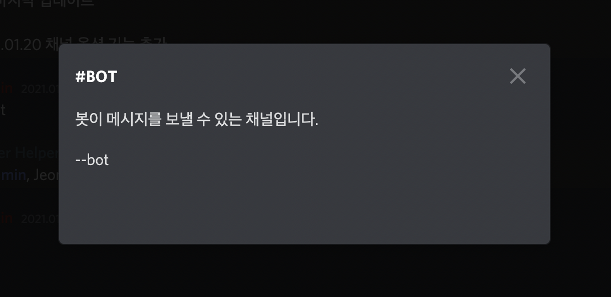
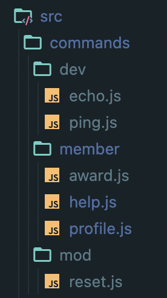
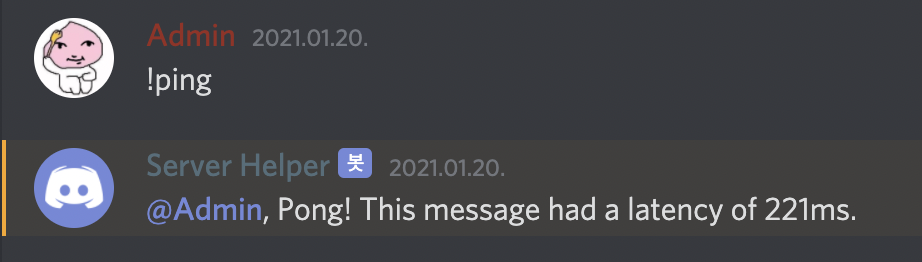

discord.js를 이용해 디스코드 봇을 제작하는 과정과 느낀 점에 대해 공유합니다.

---


활동하던 디스코드 서버의 활동률이 점차 줄어드는 것이 보여서 서버 유저들의 활동을 유도하고자 예전에 제작했던 메시지 통계봇입니다. 디스코드 서버에 상주하면서 메시지가 올라오면 해당 메시지를 분석해 `MongoDB`에 데이터를 업데이트하는 구조입니다. 해당 봇의 전체 코드는 아래 깃허브 링크에서 확인할 수 있습니다.

[코드 보러가기](https://github.com/greenblues1190/Discord-Stats)

---

## Node.js 및 모듈 설치

가장 중요한 `Node.js`! 자바스크립트로 모든 것을 해결하기 위해 `Node.js`를 설치합시다. 맥 환경이라면 [NVM](https://github.com/nvm-sh/nvm)을 사용하는 것을 추천합니다. 설치 방법은 구글 검색을 통하면 많은 자료가 나오기 때문에 따로 적지는 않겠습니다.

터미널을 열어 `Node.js`를 설치했다면 프로젝트를 위한 폴더를 하나 만들어 `npm init` 명령어로 `package.json`을 생성합니다. 프로젝트 폴더의 루트 경로에 `index.js`파일도 하나 생성해줍니다.

4가지 모듈을 설치합니다.

```shell
npm install discord.js fs gm mongoose
```

```json:title=package.json
"dependencies": {
  "discord.js": "^12.5.1",
  "fs": "0.0.1-security",
  "gm": "^1.23.1",
  "mongoose": "^5.11.12"
}
```

제 경우 원활한 테스트를 위한 `nodemon`도 설치했습니다.

`npm install nodemon --save-dev`

---

## discord.js

>discord.js is a powerful node.js module that allows you to interact with the Discord API very easily. It takes a much more object-oriented approach than most other JS Discord libraries, making your bot's code significantly tidier and easier to comprehend. Usability, consistency, and performance are key focuses of discord.js, and it also has nearly 100% coverage of the Discord API. It receives new Discord features shortly after they arrive in the API.

디스코드는 공식 API가 있는데 봇을 만들 때 쉽게 이용할 수 있게 도와주는 것이 `discord.js` 모듈입니다. 로그인, 메시지 파싱, 어드민 명령어 등을 간단한 함수로 사용할 수 있습니다. 예시 Ping 코드를 보며 살펴보도록 합시다.

### example

```javascript
const Discord = require('discord.js');
const client = new Discord.Client();

client.on('ready', () => {
  console.log(`Logged in as ${client.user.tag}!`);
});

client.on('message', msg => {
  if (msg.content === 'ping') {
    msg.reply('Pong!');
  }
});

client.login('token');
```

4번 줄부터 차례대로 살펴보면, `client.on()`은 이벤트가 발생하면 실행되는 이벤트 핸들러입니다. 첫번째 파라미터인 'ready'와 'message'는 각각 이벤트의 종류입니다. 'ready'는 디스코드에 로그인을 완료했을 때 실행됩니다. 'message'는 봇이 상주하는 서버에 메시지가 올라오면 실행됩니다. `client.login()`은 [디스코드 개발자 페이지](https://discord.com/developers/applications)에서 등록한 토큰을 이용해 봇을 로그인하는 함수입니다.

message 리스너를 좀 더 살펴보도록 합시다. `client.on()` 함수의 두번째 파라미터에는 리스너 함수가 오도록 되어있습니다. `msg`는 수신한 메시지를 담은 변수입니다. 디스코드 메시지에는 여러 정보가 포함되어 있는데 그 중 사용자가 보낸 텍스트는 `msg.content`는 들어있습니다. 만약 사용자가 "ping"이라는 텍스트를 보냈다면 "Pong!"이라는 답장을 하는 것이 이 코드가 하는 일입니다. 이 부분을 수정한다면 사용자가 어떠한 메시지를 보냈을 때 봇이 특정 행동을 하게끔 하는 것이 가능해집니다.

---

## MongoDB

사용자 데이터와 각종 정보를 저장하기 위해 `MongoDB`를 사용했습니다. 특별한 이유는 없고 단지 그 동안의 프로젝트에서 많이 사용해 익숙하여 빨리 개발할 수 있기 때문이었습니다. 스토리지는 클라우드 서비스인 `MongoDB Atlas`를 사용했습니다.

### MongoDB 연결하기

`MongoDB Atlas`에서 받은 uri를 이용해 MongoDB를 연결합니다.

```javascript
const { MONGO_URI, BOT_TOKEN } = require('./config/key');

const mongoose = require("mongoose");
const connect = mongoose.connect(MONGO_URI,
  {
    useNewUrlParser: true, useUnifiedTopology: true,
    useCreateIndex: true, useFindAndModify: false
  })
  .then(() => console.log("==> MongoDB Connected..."))
  .catch(err => console.error(err));
```

### User 스키마 작성하기

id, username, 서버 ID, 멘션된 횟수, 메시지 보낸 횟수, 기여도, 레벨 등을 저장합니다. 루트 폴더에 `models`라는 폴더를 만들고 `User.js`라는 파일로 저장합니다.

```javascript
const mongoose = require('mongoose');

const userSchema = mongoose.Schema({
    id: {
        type: Number,
    },
    username: {
        type: String
    },
    guildId: {
        type: Number
    },
    guildName: {
        type: String
    },
    mentioned: {
        type: Number,
        default: 0
    },
    messaged: {
        type: Number,
        default: 0
    },
    xp: {
        type: Number,
        default: 0
    },
    level: {
        type: Number,
        default: 0 
    }
})

const User = mongoose.model('User', userSchema);

module.exports = { User };
```

---

## 메시지 처리

### 필요없는 메시지 무시 및 콘솔 로그

```javascript
client.on("message", async (message) => {
  if (!message.guild) return;
  if (message.author.bot) return;

  console.log(`@${timestampConvert(message.createdTimestamp)}, [${message.channel.guild.name}] > [${message.channel.name}] ${message.author.username}: "${message.content}"`)ㅁ
  ...
```

메시지가 디스코드 서버에서 온 것이 아니거나 다른 봇이 보냈을 경우 무시합니다. 받은 메시지를 콘솔 창에 기록합니다.

### 유저 검색 및 메시지 카운트

```javascript
    ...
    await User.findOne({ id: message.author.id, guildId: message.channel.guild.id }, async (err, user) => {
        if (!user) {
            const newUser = new User({
                id: message.author.id,
                username: message.author.username,
                guildId: message.channel.guild.id,
                guildName: message.channel.guild.name,
                mentioned: 0,
                messaged: 0,
                xp: 0,
                level: 0
            });
            await newUser.save((err, doc) => {
                if (err) console.log(`Failed to save user ${message.author.username}!`, err)
                console.log(`new user ${message.author.username} saved`);
            });
        }
        count(message);
    })
    ...
```

DB에서 메시지를 보낸 유저 id와 서버 id가 있는지 찾아 없으면 해당 서버의 새로운 유저이므로 저장하는 코드입니다. 메시지를 수신한 순서대로 DB에 업데이트 하기 위해 `Async/Await`으로 구현했습니다. `count(message)`는 메시지를 분석해 메시지 횟수, 멘션 횟수, 기여도를 증가시키는 함수입니다. `./src/count.js`에 있습니다.

```javascript
const { User } = require("../models/User");
const { XP_CHANNEL } = require("../config/config");

const count = (message) => {
  /* 
   * author를 찾아 message time 1 증가
   * work 게시판에 올리면 xp 1 증가
   */

  User.findOne({ id: message.author.id, guildId: message.channel.guild.id }, (err, user) => {
    let channelXP = 0;
    XP_CHANNEL.forEach(channel => {
      if (message.channel.id == channel.id) {
        channelXP = channel.xp;
        }
      })

      if (!user) {
        console.log("no user to update messaged!");
      } else {
        updateVariables = {
        messaged: user.messaged + 1,
        xp: user.xp + channelXP
      }
      User.findOneAndUpdate({ id: message.author.id, guildId: message.channel.guild.id }, updateVariables, (err, doc) => {
        if (err) console.error(`Failed to update user message time ${message.author.username}!`, err)
      });
    }
  })

  /* 
   * mention된 user가 있으면 해당 user를 찾아 mention time 1 증가
   */
  if (message.mentions.users.size) {
    message.mentions.users.map((mentionedUser, index) => {
      if (mentionedUser.bot) return;

      User.findOne({ id: mentionedUser.id, guildId: message.channel.guild.id }, (err, user) => {
        if (!user) {
          console.log("no user to update mentioned!");
        } else {
          User.findOneAndUpdate({ id: mentionedUser.id, guildId: message.channel.guild.id }, { mentioned: user.mentioned + 1 }, (err, doc) => {
            if (err) console.error(`Failed to update user mentioned time ${message.author.username}!`, err)
          });
        }
      })
    })
  }
}

module.exports = { count }
```

### 명령어 실행

```javascript
  ...
  /*
   * 명령어 prefix로 시작하지 않으면 count() 후 리턴
   */
  if (!message.content.startsWith(COMMAND_PREFIX) || message.content === COMMAND_PREFIX) {
    return;
  }

  /* 
   * bot channel일 경우 command 처리
   */
  if (!getChannelOption(message).has(BOT_OPTION)) {
    return;
  }

  const commandBody = message.content.slice(COMMAND_PREFIX.length);
  const args = commandBody.split(' ');
  const command = args.shift().toLowerCase();

  runCommand(command, message, args);
});

/* 
 * 메시지가 온 채널의 옵션을 반환
 */
function getChannelOption(message) {
  let optionSet = new Set();
  channelTopic = message.channel.topic;
  if (channelTopic) {
    const parsedWithSpace = channelTopic.split(/\r\n|\r|\n| /);
    parsedWithSpace.forEach(parsedWithSpace => {
      if (!parsedWithSpace.startsWith(CHANNEL_OPTION_PREFIX)) {
        return;
      }
      const option = parsedWithSpace.slice(CHANNEL_OPTION_PREFIX.length);
      optionSet.add(option);
    })
  }
  return optionSet;
}
```

명령어 prefix로 시작하고 봇이 활동할 수 있게끔 설정되어 있는 채널에서 온 메시지인지 확인합니다. 봇이 활동할 수 있는 채널은 디스코드 채널의 주제에 `BOT_OPTION`을 적으면 그것을 읽어와 확인하도록 했습니다. 채널 주제는 `message.channel.topic`에 저장되어있습니다. 봇 옵션과 일반 단어를 구분하기 위해 `CHANNEL_OPTION_PREFIX`로 시작한 것들만 파싱하도록 했습니다. 저의 경우 `--`를 `CHANNEL_OPTION_PREFIX`로, `bot`을 `BOT_OPTION`으로 지정했습니다.



이상의 조건이 만족되면 `runCommand`로 명령어를 실행합니다. 이 함수가 하는 일에 대해서는 다음 장에서 자세히 설명하겠습니다.

---

## 명령어 설정 및 처리

### 명령어 설정

`./src/commands` 폴더에 명령어들을 저장합니다.



해당 js파일들은 다음과 같은 형태로 되어있습니다.

```javascript
const execute = async (client, message, args) => {
    const timeTaken = Date.now() - message.createdTimestamp;
    message.reply(`Pong! This message had a latency of ${timeTaken}ms.`);
}

module.exports = {
    name: 'ping',
    alias: ['vld', 'botping', '핑'],
    description: 'Ping!',
    use: '!ping',
    auth: ['Mods', 'mod'],
    execute
}
```

`ping.js` 파일입니다. 제가 테스트를 하기 위해 "!ping"이라는 메시지를 입력하면 "Pong!"과 함께 답장까지 걸린 지연시간을 보내도록 되어있습니다.

`execute`에는 해당 명령어가 처리하는 일을 작성합니다. 그 외 `name`에는 명령어 prefix를 제외한 명령어 이름, `alias`에는 해당 명령어 이름 대신에 사용해도 해당 명령어가 실행되는 다른 이름들, `description`에는 해당 명령어가 하는 일에 대한 설명글, `use`에는 해당 명령어의 사용례, `auth`에는 명령어를 사용할 수 있는 서버 역할들이 들어갑니다.



### 명령어 파일 읽기

이렇게 작성한 명령어 파일들은 봇을 실행시키면 fs 모듈로 읽었습니다.

```javascript
/* 
 * command 세팅
 */
client.commands = new Discord.Collection() // commands를 discord.collection을 사용하였습니다.
client.alias = new Discord.Collection()// aliases를 discord.collection을 사용하였습니다.

const fs = require('fs');
console.log("==> Loading commands...");
fs.readdirSync("./src/commands/").forEach(dir => { // fs 모듈을 이용하여 ./Commands/ 폴더 안에 내용을 불러와 forEach를 합니다 이후에 선언되는 것은 dir로 합시다.
  if (dir != '.DS_Store') {
    const Filter = fs.readdirSync(`./src/commands/${dir}`).filter(f => f.endsWith(".js")); // Fillter를 선언하여 Commands/여러 폴더들을 안에 .js로 끝나는 것들로 필터링 합시다.
    Filter.forEach(file => {  // 안에 .js 파일들을 forEach하여 이후에 선언되는 것은 file로 합시다
      const command = require(`./src/commands/${dir}/${file}`); // cmd를 선언하여 ./Commands/${dir}/${file}가 필요하다고 합시다
      client.commands.set(command.name, command) // 우리가 콜랙션으로 지정한 것들을 지정해줍시다 (안에 괄호는 그 안에 있는 config에 name을 지정하고 명령어에 이름을 저장합니다.)
      command.alias.forEach(alias => {
        client.alias.set(alias, command.name)
      })
      console.log(` /src/commands/${dir}/${file}`);
    })
  }
})
console.log("==> Commands loaded...")
```

`index.js`의 커맨드 세팅 부분입니다. `fs` 모듈로 `./src/commands/`의 하위폴더에 있는 js파일들을 읽어와 명령어 이름과 명령어, alias를 `client.commands`와 `client.alias`에 저장합니다.

```javascript
/* 
 * 커맨드 실행 권한이 있으면 true 아니면 false
 */
function isAuth(command, message) {
  const userRole = getUserRole(message);
  let flag = false
  if (command.auth == null ||
    doesAHaveSetB(command.auth, userRole)) {
    return true;
  }
  return false;
}

/*
 * 명령어 실행 함수
 */
function runCommand(command, message, args) {
  if (client.commands.get(command) || client.alias.get(command)) {
    const cmd = client.commands.get(command) || client.commands.get(client.alias.get(command))

    if (cmd && isAuth(cmd, message)) cmd.execute(client, message, args);
    else message.reply(`잘못된 커맨드 혹은 권한이 없습니다. (${cmd.name}의 권한: ${cmd.auth})`);
    return;
  }
}
```

사용자가 보낸 명령어를 `client.commands` 혹은 `client.alias`에서 찾아 실행합니다. 만약 명령어가 있다면 사용자의 서버 역할이 명령어를 실행할 수 있는 권한이 있는지 확인합니다.

(`isAuth`의 `doesAHaveSetB`는 B가 A를 포함하고 있는지 확인하기 위해 만든 간단한 코드입니다. `./src/util.js`에 정의되어 있습니다.)

```javascript
const doesAHaveSetB = (A, B) => {
    if (A.some(a => {
        if (B.has(a))
            return true;
        }
    })) {
        return true;
    }
    return false;
}
```

---

## award 구현

봇의 가장 핵심적인 기능 중 하나인 award 명령어를 살펴보겠습니다. 사용자 기여도가 가장 높은 순으로 3위까지 보여주는 명령어입니다. 순위를 좀 더 예쁘게 보여주기 위해 `gm`이라는 이미지 프로세싱 모듈을 이용했습니다.

```javascript
const gm = require('gm');
const Discord = require('discord.js');
const { User } = require("../../../models/User");
const { XP_ALIAS } = require("../../../config/config");

const execute = async (client, message, args) => {
  const mostMessagedUser = await User.findOne({ guildId: message.channel.guild.id })
      .sort('-messaged')
      .exec()
      .then((user) => {
        return user;
      })
      .catch((err) => {
        console.error(err);
      })

  const mostMentionedUser = await User.findOne({ guildId: message.channel.guild.id })
    .sort('-mentioned')
    .exec()
    .then((user) => {
      return user;
    })
    .catch((err) => {
      console.error(err);
    })

  const mostXPedUser = await User.findOne({ guildId: message.channel.guild.id })
    .sort('-xp')
    .exec()
    .then((user) => {
      return user;
    })
    .catch((err) => {
      console.error(err);
    })
  ...
```

`mongoose`의 `findOne` 함수를 이용해 `messaged`, `mentioned`, `xp`가 가장 높은 사용자를 조회합니다.

```javascript
  ...
  /* 
   * 이미지 생성 및 첨부
   */
  const text_kor =
    `${XP_ALIAS} 1위!\n` +
    (mostXPedUser ? `${mostXPedUser.username} (${mostXPedUser.xp}포인트)\n` : "N/A\n") +
    `\n` +
    `메세지 1위!\n` +
    (mostMessagedUser ? `${mostMessagedUser.username} (${mostMessagedUser.messaged}회)\n` : "N/A\n") +
    `\n` +
    `멘션 1위!\n` +
    (mostMentionedUser ? `${mostMentionedUser.username} (${mostMentionedUser.mentioned}회)` : "N/A");

  gm('./assets/images/award.png')
    .font('./assets/fonts/Noto_Sans_KR/NotoSansKR-Medium.otf', 33)
    .drawText(
      0,
      70,
      text_kor
      , 'Center')
    .encoding('Unicode')
    .toBuffer('JPG', (err, buffer) => {
      if (err) console.error(err);
      const attachment = new Discord.MessageAttachment(buffer, 'text-image.jpg');
      message.reply(
        `${message.channel.guild.name} 어워드`
        , attachment)
    })
}

module.exports = {
  name: 'award',
  alias: ['어워드'],
  description: '서버 어워드',
  use: '!stat',
  auth: null,
  execute
}
```

이미지를 생성하여 답장에 첨부하는 코드입니다. `./assets/images/award.png`를 읽어와 텍스트를 삽입합니다. 무료 폰트인 `NotoSansKR-Medium`를 사용했습니다. `Discord.MessageAttachment` 객체를 생성해 버퍼에 출력한 결과 이미지를 디스코드 메시지에 첨부합니다.

---

## 그리고...

### Async/Await

기존 코드에서는 비동기적으로 메시지를 처리했습니다. 여기서 발생한 가장 큰 문제는 메시지를 처리하는 속도보다 DB 작업이 훨씬 오래 걸리는데 있었습니다. A라는 사용자가 어떤 서버에 처음으로 메시지들을 보내면 DB에 사용자 정보를 저장하느라 그 사이에 온 A의 메시지들이 무시되었습니다. 이를 해결하기 위해 이벤트 핸들러에 `Async/Await`을 적용했고 메시지가 온 순서대로 처리를 함으로써 에러를 줄일 수 있었습니다.

### 남은 목표

- 채널 옵션을 활용해 채널마다 획득할 수 있는 기여도를 다르게 설정할 수 있는 기능
- 현재 텍스트로 알려주는 프로필 명령어를 gm으로 이미지를 생성하여 알려주도록 개선한
- 이 봇을 자신의 서버로 초대할 수 있는 사이트 구현
- DB 스키마 개선

Nightbot, StreamElements 등 훨씬 완성도있고 기능들이 다양한 봇에 비하면 아직 개선할 점이 많은 봇입니다. 부족한 글이지만 디스코드 봇을 만드는데 작게나마 도움이 되었으면 좋겠습니다.