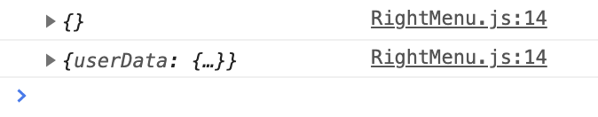

## 기대 행동

`useSelector`로 user 상태를 받아 `/profile/${user.userData._id}`를 가리키는 링크를 생성한다.

## 실제 행동

`user.userData._id`를 읽을 때 undefined 에러가 발생했다.

```
Uncaught TypeError: Cannot read property '_id' of undefined

> 121 | <Link to= {`/profile/${user.userData._id}`}>
  122 | ^ profile
  123 | </Link>
```

## 코드

```javascript
import { useSelector } from "react-redux";

function profileLink(props) {
  const user = useSelector((state) => state.user);

  return (
    <Link to={`/profile/${user.userData._id}`}>
      profile
    </Link>
  )
}
```

## 원인

비슷한 상황의 스택오버플로우 질문글에 대한 답변이 있었다.

[React useSelector first returns undefined, then returns object](https://stackoverflow.com/a/60549441/15072068)

> These undefined values are from async operations, so its their behaviour that sometimes before promise is completed return undefined value.

콘솔 로그로 확인해보니 `useSelector`로 상태를 가져왔을 때 먼저 undefined를 반환한 다음 object를 반환하는 것을 확인했다.



## 해결

해결방법으로 reducer에서 1. `user.userData._id`에 초기값을 주거나, 2. 리액트 컴포넌트에서 `user.userData`가 존재하는지 확인 후 해당 데이터를 읽어 렌더링하하면 해결되지 않을까 생각했다. 다만 1번처럼 reducer에서 초기 상태를 주니 여전히 `user.userData`가 undefined 타입 에러가 발생했다.

```javascript{3-7}
const rootReducer = combineReducers(
    user: {
      // initial state
      userData: {
        _id: '',
        isAuth: false
      }
    },
});
```

`user.userData`가 존재하면 컴포넌트를 렌더링하도록 수정하여 해결했다.

```javascript{6-10}
import { useSelector } from "react-redux";

function profileLink(props) {
  const user = useSelector((state) => state.user);

  if (user.userData) {
    return ...
  } else {
    return null
  }
}
```
