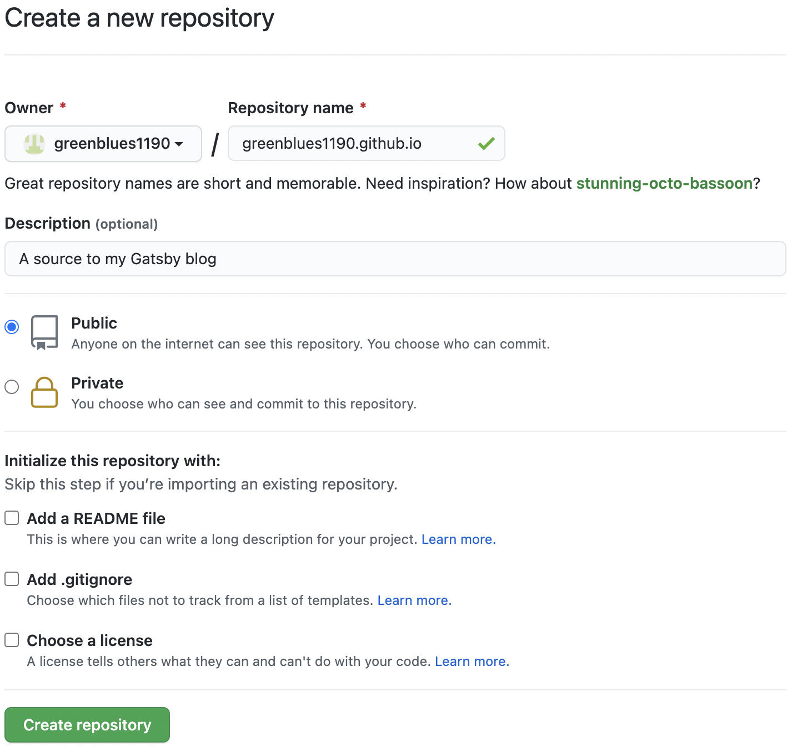
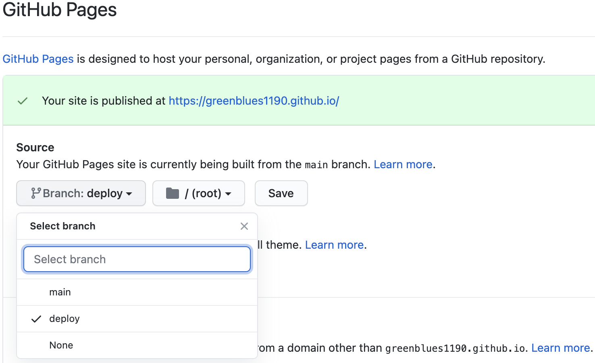
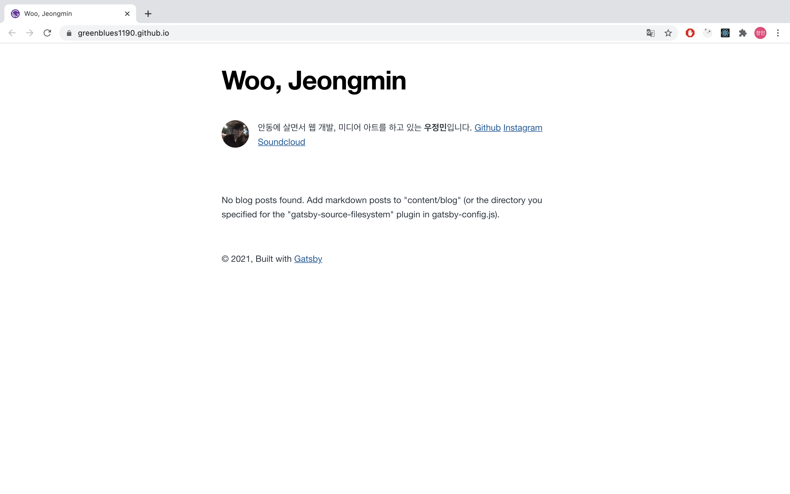
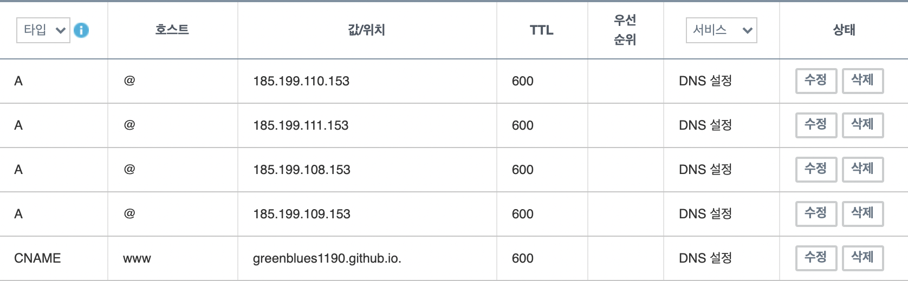

그동안 티스토리를 블로그로 써오다가 웹 개발 공부 겸 본인 사이트를 만들어 보는 것이 많은 도움이 된다는 조언을 듣고 직접 블로그를 만들게 되었습니다. Gatsby로 블로그를 제작하며 느꼈던 점들과 사용한 방법들에 관해 기술합니다.

---

## 개발 목표

블로그를 만들기 전 잡은 대략적인 방향들입니다.

- 정적사이트 생성기 사용
- Github Pages 배포
- 태그 기능
- 포스트 내 앵커 기능
- 댓글 기능
- 커스텀 도메인 적용
- SEO 설정

Static Site Generator에 대해 검색해보니 Jekyll, Gatsby, Hugo 등 많은 선택지가 있었습니다. 그 중 한글 문서가 많고 리액트를 사용하는 Gatsby를 선택했습니다.

---

## Gatsby 시작하기

### Gatsby Cli 설치

Gatsby를 시작하기 위해 `npm install -g gatsby-cli`로 Gatsby Cli를 전역으로 설치합니다. Gatsby Cli는 Gatsby 어플리케이션을 실행하고 배포를 위한 빌드 기능 등을 사용하기 위한 프로그램입니다.

> M1 맥을 사용하는 분들은 gatsby-cli를 설치하기 위한 npm upstream이 Node.js 버전 15.3.0 밑에서는 arm64와 호환이 되지 않습니다. 만약 애플 실리콘 네이티브로 개발을 하고 싶다면 꼭 Node.js 버전을 **15.3.0 이상**으로 업데이트해주세요!

### Gatsby 스타터 선택

Gatsby에는 다른 사용자들이 미리 만들어둔 다양한 [스타터](https://www.gatsbyjs.com/starters/?)들이 존재합니다. 저는 [gatsby-starter-blog](https://www.gatsbyjs.com/starters/gatsbyjs/gatsby-starter-blog/)라는 미니멀한 스타터를 선택했습니다. 만들고 싶은 사이트의 목적에 따라 적합한 스타터를 골라 터미널에 `gatsby new [폴더] [스타터-깃허브-주소]`를 입력하면 지정한 폴더에 해당 스타터를 설치합니다.

### Gatsby Configuration

스타터를 설치한 폴더에서 `gatsby develop`을 입력하면 로컬 development server를 시작합니다. 브라우저 주소창에 `localhost:8000`을 입력하니 스타터의 기본 설정된 사이트가 보이네요. 이제부터 바꿔보도록 합시다.

`/gatsby-config.js`에서 사이트 메타데이터와 gatsby 플러그인 설정을 수정할 수 있습니다. 먼저 사이트 메타데이터를 수정합니다.

```javascript:title=gatsby-config.js
module.exports = {
    siteMetadata: {
        title: `Woo, Jeongmin`,
        author: {
        name: `우정민`,
        summary: `안동에 살면서 웹 개발, 미디어 아트를 하고 있는`,
        description: `안동에 살면서 웹 개발, 미디어 아트를 하고 있는 우정민입니다.`,
            siteUrl: `https://greenblues1190.github.io/`,
            social: {
            github: `greenblues1190`,
            instagram: `srrlmnth`,
            soundcloud: `srrlmnth`,
            twitter: `greenblues1190`,
        },
    },
    ...
}
```

bio 정보를 `src/components/bio.js` 컴포넌트에서 관리하는군요. 소셜 정보와 프로필 양식을 수정합니다.

```jsx:title=bio.js
...
site {
    siteMetadata {
    author {
        name
        summary
    }
    social {
        github
        instagram
        soundcloud
        twitter
    }
    }
}
...
{author?.name && (
    <p>
    {author?.summary || null}  <strong>{author.name}</strong>입니다.
    {` `}
    <a href={`https://github.com/${social?.github || ``}`}>
        Github
    </a>
    {` `}
    <a href={`https://github.com/${social?.github || ``}`}>
        Instagram
    </a>
    {` `}
    <a href={`https://github.com/${social?.github || ``}`}>
        Soundcloud
    </a>
    </p>
)
```

그리고 `/content/assets/profile-pic.jpg`를 바꾸면...


이와 같이 스타터를 조금씩 수정하는 것만으로 편하게 사이트를 제작할 수 있습니다.

---

## Github Pages로 배포하기

### Github 저장소 생성

Github Pages를 만들기 위해 먼저 Github 저장소를 생성합니다. 저장소의 이름을 아무렇게 하면 url이 `[사용자이름].github.io/[프로젝트이름]`이 되기 때문에 프로젝트 이름이 붙지 않는 url을 사용하고 싶으면 저장소 이름을 `[사용자이름].github.io`로 해주세요.



저장소를 생성했으면 블로그 폴더를 원하는 branch에 push합니다. Gatsby를 빌드하면 파일이 어지러워지기 때문에 저처럼 main branch가 깔끔하길 원하시다면 소스코드를 main으로, 빌드된 파일을 deploy라는 branch로 관리해주세요.

```shell
git init
git add .
git commit -m "first commit"
git branch -M main
git remote remove origin
git remote add origin [깃_주소]
git push -u origin main
```

### 블로그 빌드, 배포

gh-pages를 설치합니다. gh-pages는 원하는 branch에 Github Pages를 배포할 수 있도록 도와주는 모듈입니다.

```shell
npm install gh-pages --save-dev
```

deploy라는 branch를 Github Pages로 쓰겠습니다. 다음 줄을 package.json의 scripts에 추가해주세요. 블로그를 build한 뒤 deploy라는 branch에 푸시하라는 스크립트입니다.

```json:title=package.json
"scripts": {
    ...
    "deploy": "gatsby build && gh-pages -d public -b deploy",
    ...
}
```

스크립트를 설정하면 다음 명령어로 Gatsby 사이트를 Github Pages에 배포할 수 있습니다.

```shell
npm run deploy
```

깃허브 저장소 Settings에서 Github Pages의 source branch를 build 파일이 푸시된 branch로 설정하고 저장합니다.



배포된 Github Page는 `https://[사용자이름].github.io/`로 접속할 수 있습니다.



---

## 커스텀 도메인 설정

### 도메인 등록

[가비아](https://www.gabia.com/)에서 구매했습니다. DNS도 해당 업체의 서비스를 이용했습니다.

### A 레코드 설정

해당 도메인의 DNS 레코드 관리 설정에서 `ALIAS`, `ANAME` 혹은 `A` 레코드를 생성합니다. `A` 레코드를 생성하기 위해 [다음 IP 주소](https://docs.github.com/en/pages/configuring-a-custom-domain-for-your-github-pages-site/managing-a-custom-domain-for-your-github-pages-site)를 추가합니다.

```
185.199.108.153
185.199.109.153
185.199.110.153
185.199.111.153
```



### gatsby-plugin-cname으로 CNAME 생성하기

Github Pages를 통해 배포를 하다보면 [Github Pages에서 설정한 커스텀 도메인이 초기화되는 문제](https://github.com/tschaub/gh-pages/issues/213)가 발생합니다. Github가 CNAME 파일을 참고하기 때문인데요. CNAME을 생성하는데는 다음과 같은 방법들이 있습니다.

1. `public` 폴더에 `CNAME` 파일 생성
2. npm 스크립트에 `echo "customdomain.com" > build/CNAME` 추가
3. **gatsby-plugin-cname 사용**

그 중 첫번째와 두번째 방법은 커스텀 도메인이 바뀔 때마다 직접 수정을 해야하는 불편함이 있습니다. [gatsby-plugin-cname](https://www.gatsbyjs.com/plugins/gatsby-plugin-cname/)은 `gatsby-config.js`에서 siteUrl을 읽어와 자동으로 CNAME을 생성해주는 유용한 플러그인입니다. 아래 명령어로 설치합니다.

`npm install gatsby-plugin-cname`

플러그인 설치 후 `gatsby-config.js` 파일에 다음을 추가합니다. `npm run deploy`로 배포 시, `gatsby-config.js` 파일의 siteUrl을 읽어 자동으로 CNAME이 생성됩니다.

```diff-javascript:title=gatsby-config.js
module.exports = {
  siteMetadata: {
-    siteUrl: `https://greenblues1190.github.io/`
+    siteUrl: `https://your.custom.domain/`
  },
  plugins: [
+    `gatsby-plugin-cname`
  ],
}
```
