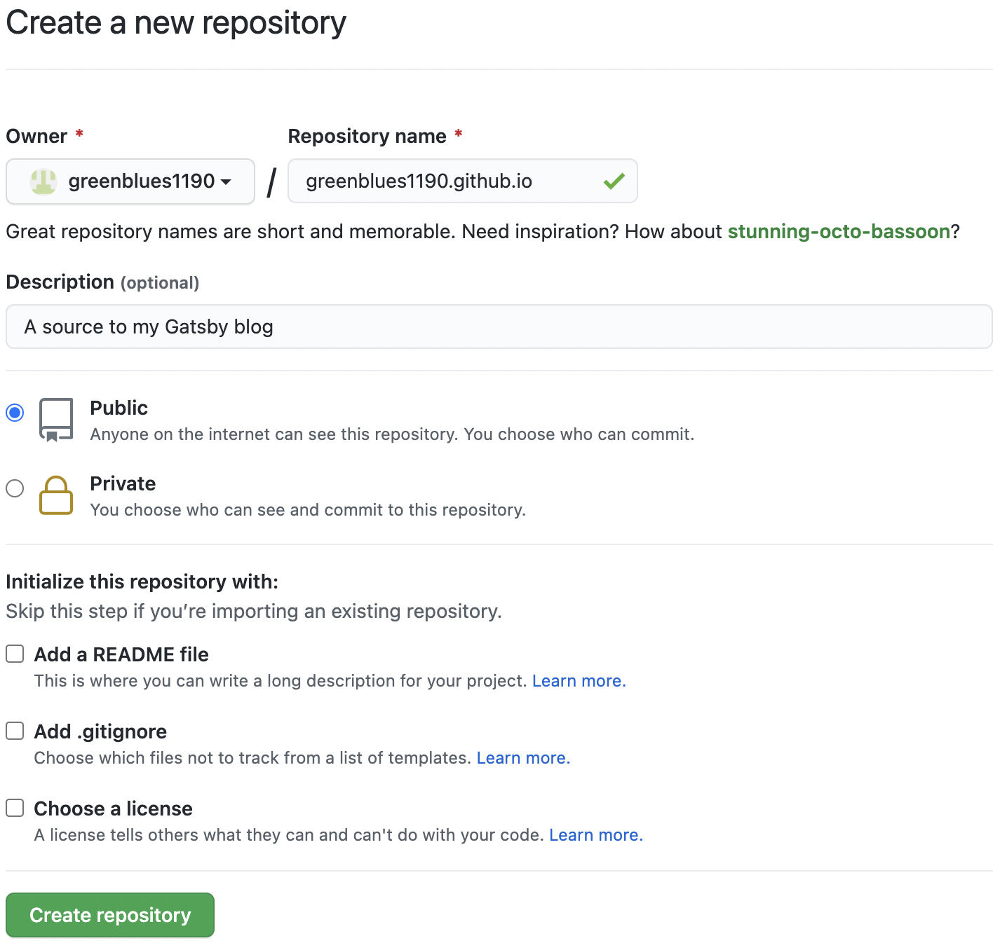
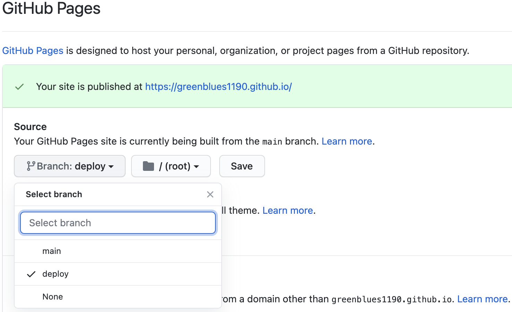
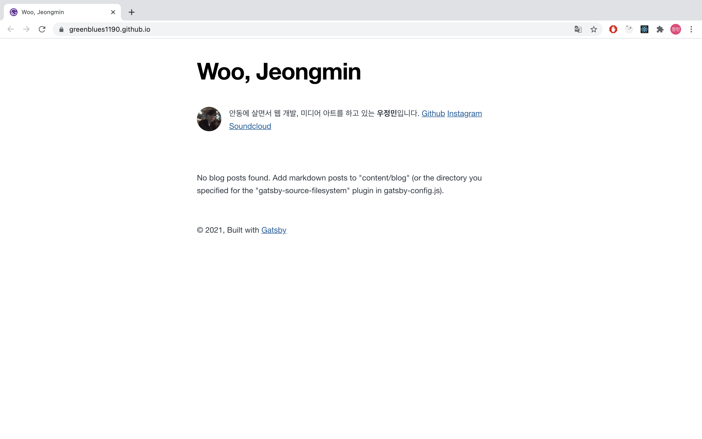

그동안 티스토리를 블로그로 써오다가 웹 개발 공부 겸 본인 사이트를 만들어 보는 것이 많은 도움이 된다는 조언을 듣고 직접 블로그를 만들게 되었습니다. Gatsby로 블로그를 제작하며 느꼈던 점들과 사용한 방법들에 관해 기술합니다.

---

## 목차

- Github 저장소 생성, 푸시
- 블로그 빌드, 배포

---

### Github 저장소 생성

Github Pages를 만들기 위해 먼저 Github 저장소를 생성합니다. 저장소의 이름을 아무렇게 하면 url이 `[사용자이름].github.io/[프로젝트이름]`이 되기 때문에 프로젝트 이름이 붙지 않는 url을 사용하고 싶으면 저장소 이름을 `[사용자이름].github.io`로 해주세요.



저장소를 생성했으면 블로그 폴더를 원하는 branch에 push합니다. Gatsby를 빌드하면 파일이 어지러워지기 때문에 저처럼 main branch가 깔끔하길 원하시다면 소스코드를 main으로, 빌드된 파일을 deploy라는 branch로 관리해주세요.

```shell
git init
git add .
git commit -m "first commit"
git branch -M main
git remote remove origin
git remote add origin [깃_주소]
git push -u origin main
```

### 블로그 빌드, 배포

gh-pages를 설치합니다. gh-pages는 원하는 branch에 Github Pages를 배포할 수 있도록 도와주는 모듈입니다.

```shell
npm install gh-pages --save-dev
```

deploy라는 branch를 Github Pages로 쓰겠습니다. 다음 줄을 package.json의 scripts에 추가해주세요. 블로그를 build한 뒤 deploy라는 branch에 푸시하라는 스크립트입니다.

```json
"scripts": {
    ...
    "deploy": "gatsby build && gh-pages -d public -b deploy",
    ...
}
```

스크립트를 설정하면 다음 명령어로 Gatsby 사이트를 Github Pages에 배포할 수 있습니다.

```shell
npm run deploy
```

깃허브 저장소 Settings에서 Github Pages의 source branch를 build 파일이 푸시된 branch로 설정하고 저장합니다.



배포된 Github Page는 `https://[사용자이름].github.io/`로 접속할 수 있습니다.

