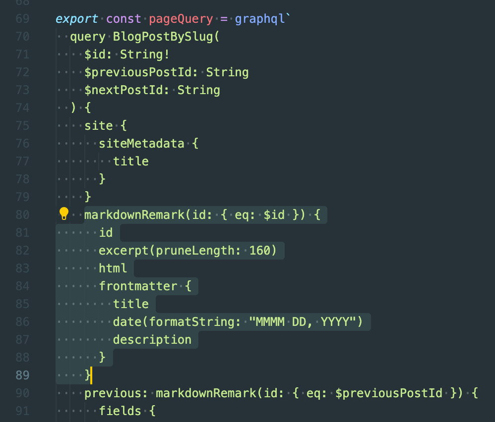
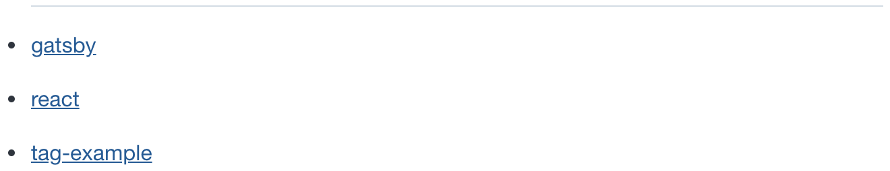
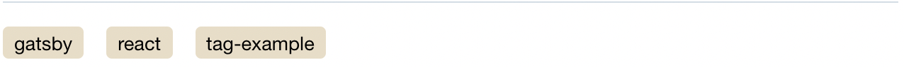
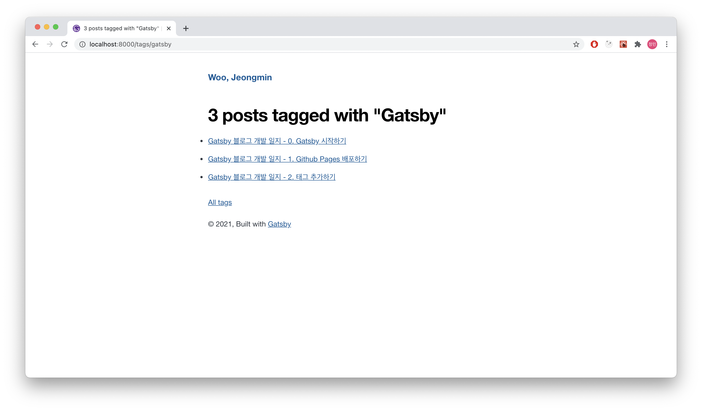
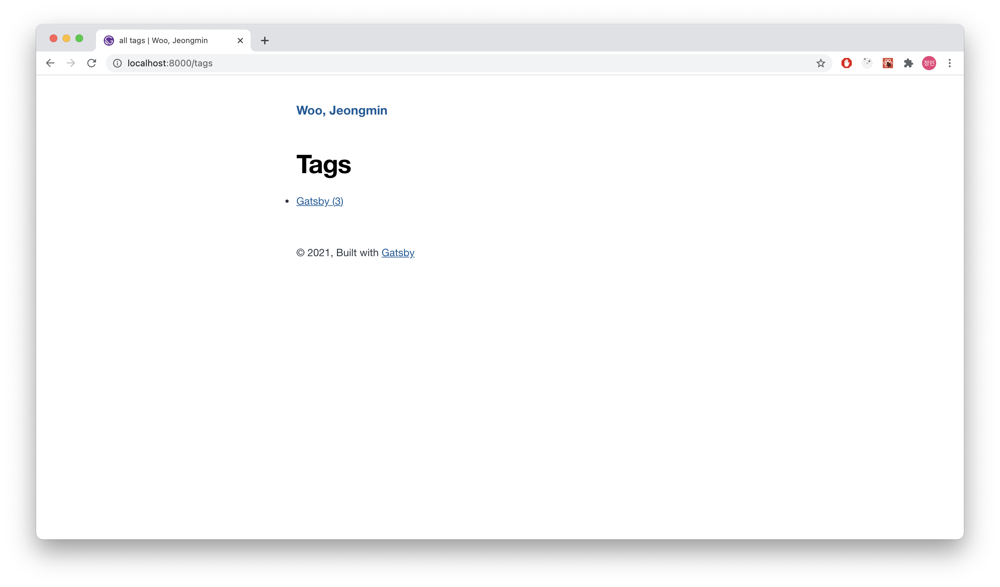

같은 주제에 대한 글을 모아 볼 수 있도록 태그를 추가해봅시다.

---

## 목차

- 포스트에 태그 추가하기
- 태그 별 포스트 페이지
- /tags 페이지

---

### 포스트에 태그 추가하기

마크다운 문서에서는 메타데이터를 YAML 헤더에 작성할 수 있습니다.

```markdown
---
title: "Gatsby 블로그 개발 일지 - 2. 태그 추가하기"
date: "2021-01-30 21:36:00"
---
```
title과 date 다음에 tags를 넣습니다.

```markdown{5-7}
---
title: "Gatsby 블로그 개발 일지 - 2. 태그 추가하기"
date: "2021-01-30 21:36:00"
tags:
    - Gatsby
    - React
    - Tag Example
---
```

이제 이 태그들을 읽어와 각 포스트 하단에 보여줄 차례입니다. 우리가 지금까지 작성한 모든 블로그 포스트 데이터는 GraphQL 데이터베이스에 들어있습니다. 따라서 GraphQL 쿼리를 활용하면 tags 데이터를 가져올 수 있습니다. `/src/templates/blog-post.js`의 하단에 다음과 같은 GraphQL 쿼리가 있습니다.



다음과 같이 tags를 추가해줍니다.

```javascript
markdownRemark(id: { eq: $id }) {
    id
    excerpt(pruneLength: 160)
    html
    frontmatter {
    title
    date(formatString: "MMMM DD, YYYY")
    description
    // highlight-next-line
    tags
    }
}
```

Tag Example이란 태그가 있을 때 태그를 클릭하면 `/tags/tag-example`로 이동하는 리스트를 만들어봅시다. 리스트를 태그에 공백이 포함되어 있어도 url로 사용할 수 있게 String을 kebabcase로 변환해주는 kebabcase 모듈을 설치해줍니다.

```shell
npm install lodash.kebabcase
``` 

lodash.kebabcase를 blog-post.js 상단에 import하고 post.frontmatter.tags를 참조하여 태그 리스트를 만들어줍니다.

```jsx{1,9-19}
import kebabCase from "lodash.kebabcase"
...
const BlogPostTemplate = ({ data, location }) => {
    return (
        ...
        <section />
        <hr />
        <-- Section과 Footer 사이
        <div className="tags">
            <ul>
            {post.frontmatter.tags
                ? post.frontmatter.tags.map(tag => (
                    <li key={kebabCase(tag)}>
                        <Link to={`/tags/${kebabCase(tag)}`}>{kebabCase(tag)}</Link>
                    </li>
                    ))
                : null}
            </ul>
        </div>
        <footer />
        ...
    )
}
```

다음과 같이 리스트가 생겼습니다.



`/src/style.css`를 수정해 꾸며줍시다.
```css
.blog-post .tags ul {
  list-style: none;
}

.blog-post .tags ul li {
  display: inline-block;
  margin-right: 1rem;
  text-align: center;
}

.blog-post .tags ul li a {
  display: block;
  padding-left: 0.5rem;
  padding-right: 0.5rem;
  padding-top: 0.1rem;
  padding-bottom: 0.1rem;
  text-decoration: none;
  color: black;
  font-size: 0.85rem;
  border-width: 4px;
  border-radius: 0.25rem;
  background-color: #e9ddc5;
}

.blog-post .tags ul li a:hover {
  background-color: #d6c5a3;
}
```

이런 모습으로 만들어 봤습니다.



### 태그 별 포스트 페이지

태그를 클릭하면 나타날 태그 페이지를 만들 차례입니다. 페이지 생성은 `/gatsby-node.js`가 담당합니다. 이 자바스크립트 파일은 GraphQL로 마크다운 파일들을 읽어 포스트를 순회하며 페이지를 만드는 일을 합니다. 이 때 태그 정보도 받아와 태그페이지를 만들도록 합시다. 할 일은 다음과 같습니다.

1. kebabcase 변환을 위한 모듈을 추가하고
2. GraphQL로 tags를 받아와
4. tag를 저장하기 위한 Set 객체를 만들고
3. post를 돌며 tag를 수집한 다음
4. tag template을 참고해 tag마다 페이지 만들기

```javascript{1-2,19,26-27,44-49,53-64}
// 1. kebabcase 변환을 위한 모듈 import
const kebabCase = require(`lodash.kebabcase`)
...

exports.createPages = async ({ graphql, actions, reporter }) => {
    ...
    const result = await graphql(`
        {
            allMarkdownRemark(
                sort: { fields: [frontmatter___date], order: ASC }
                limit: 1000
            ) {
                nodes {
                    id
                    fields {
                        slug
                    }
                    frontmatter {
                        tags    // 2. tags를 받아오기 위해 추가
                    }
                }
            }
        }
    `)
    ...
    // tag를 저장하기 위한 Set
    let tags = new Set()

    if (posts.length > 0) {
        posts.forEach((post, index) => {
            const previousPostId = index === 0 ? null : posts[index - 1].id
            const nextPostId = index === posts.length - 1 ? null : posts[index + 1].id

            createPage({
                path: post.fields.slug,
                component: blogPost,
                context: {
                id: post.id,
                previousPostId,
                nextPostId,
                },
            })

            // post를 돌며 tag 수집
            if (post.frontmatter.tags) {
                post.frontmatter.tags.forEach((tag) => {
                    tags.add(tag)
                })
            }
        })
    }

    // 태그 페이지 생성
    const tagTemplate = path.resolve("src/templates/tags.js")
    // Make tag pages
    tags.forEach(tag => {
        createPage({
            path: `/tags/${kebabCase(tag)}/`,
            component: tagTemplate,
            context: {
                tag,
            },
        })
    })
}
...
```

tag 페이지 템플릿을 `/src/templates/tags.js`에 작성합니다.

```javascript
import React from "react"

import { Link, graphql } from "gatsby"
import Layout from "../components/layout"
import SEO from "../components/seo"

const Tags = ({ pageContext, data, location }) => {
  const { tag } = pageContext
  const { edges, totalCount } = data.allMarkdownRemark
  const siteTitle = data.site.siteMetadata.title
  const tagHeader = `${totalCount} post${
    totalCount === 1 ? "" : "s"
  } tagged with "${tag}"`

  return (
    <Layout location={location} title={siteTitle}>
      <SEO title={tagHeader} />
      <h1>{tagHeader}</h1>
      <ul>
        {edges.map(({ node }) => {
          const { slug } = node.fields
          const { title } = node.frontmatter
          return (
            <li key={slug}>
              <Link to={slug}>{title}</Link>
            </li>
          )
        })}
      </ul>
      <Link to="/tags">All tags</Link>
    </Layout>
  )
}

export default Tags

export const pageQuery = graphql`
  query($tag: String) {
    site {
      siteMetadata {
        title
      }
    }
    allMarkdownRemark(
      limit: 2000
      sort: { fields: [frontmatter___date], order: ASC }
      filter: { frontmatter: { tags: { in: [$tag] } } }
    ) {
      totalCount
      edges {
        node {
          fields {
            slug
          }
          frontmatter {
            title
          }
        }
      }
    }
  }
`
```



### /tags 페이지

마지막으로 모든 태그를 모아 보여줄 /tags 페이지를 만들기 위해 `/src/pages/tags.js`를 작성합니다.

```javascript
import React from "react"
import Layout from "../components/layout"
import { Link, graphql } from "gatsby"
import SEO from "../components/seo"

var kebabCase = require("lodash.kebabcase")

const TagsPage = ({
  data: {
    allMarkdownRemark: { group },
    site: {
      siteMetadata: { title },
    },
  },
  location,
}) => (
  <Layout location={location} title={title}>
    <SEO
      title="all tags"
      keywords={[`blog`, `gatsby`, `javascript`, `react`]}
    />
    <div>
      <h1>Tags</h1>
      <ul>
        {group.map(tag => (
          <li key={tag.fieldValue}>
            <Link to={`/tags/${kebabCase(tag.fieldValue)}/`}>
              {tag.fieldValue} ({tag.totalCount})
            </Link>
          </li>
        ))}
      </ul>
    </div>
  </Layout>
)

export default TagsPage

export const pageQuery = graphql`
  query {
    site {
      siteMetadata {
        title
      }
    }
    allMarkdownRemark(limit: 2000) {
      group(field: frontmatter___tags) {
        fieldValue
        totalCount
      }
    }
  }
`
```



태그 기능 완성입니다.