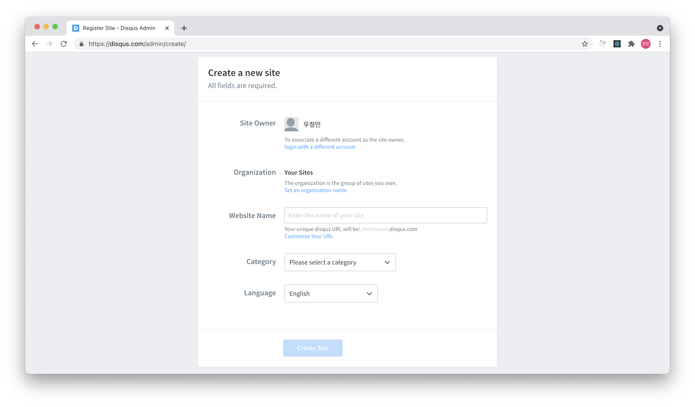
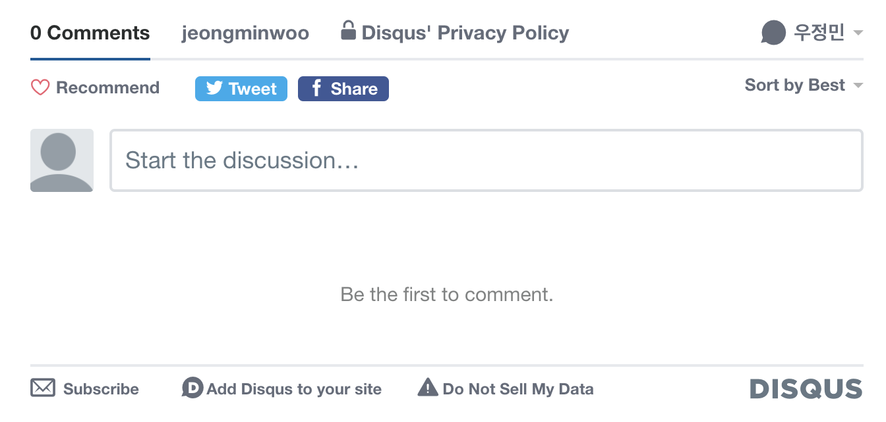
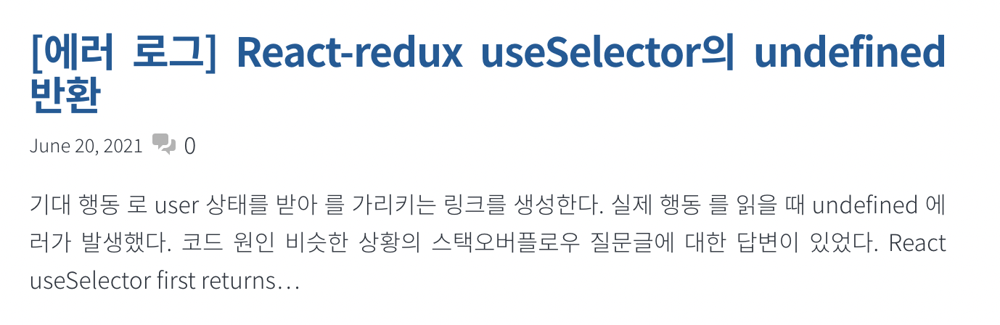
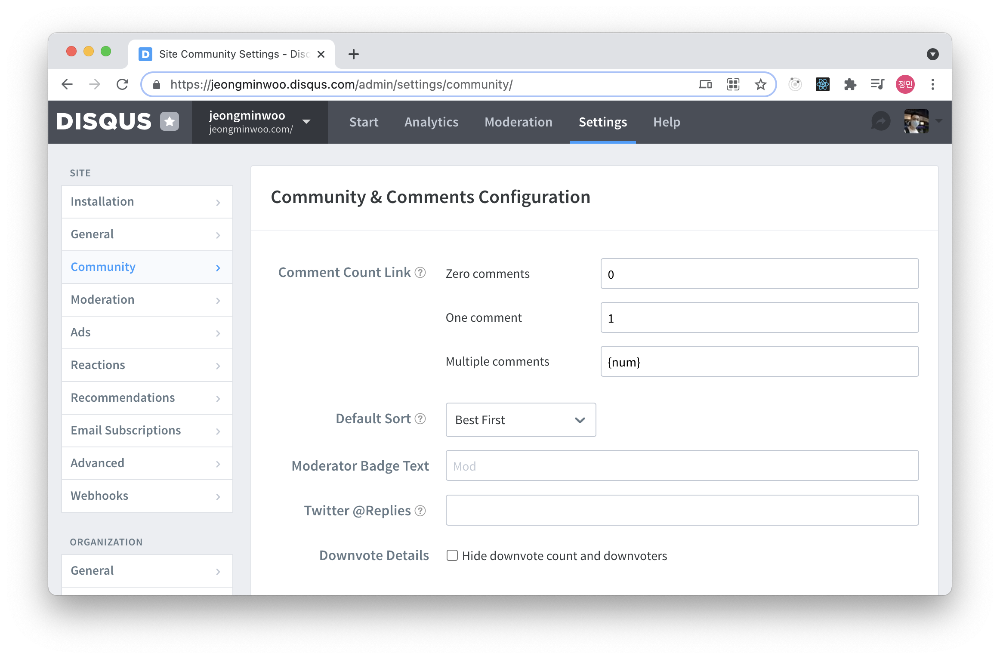
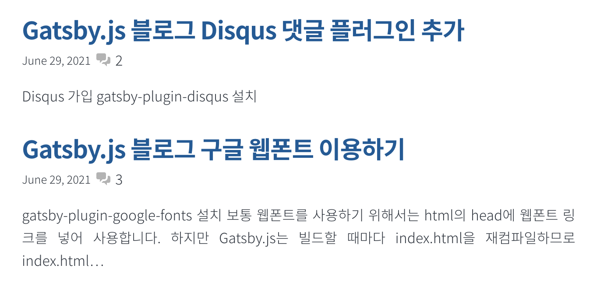

## gatsby-plugin-disqus 플러그인 추가

먼저 [Disqus 가입](https://disqus.com/profile/signup)을 합니다. Website Name으로 들어갈 shortname을 기억해주세요.



[gatsby-plugin-disqus](https://www.gatsbyjs.com/plugins/gatsby-plugin-disqus/)를 설치합니다.

`npm install -S gatsby-plugin-disqus`

`gatsby-config.js`에 다음과 같이 설정합니다. Disqus 가입 시 적은 shortname을 아래와 같이 options에 꼭 추가해주세요.


```diff-js:title="gatsby-config.js"
module.exports = {
  plugins: [
+    {
+      resolve: `gatsby-plugin-disqus`,
+      options: {
+        shortname: `jeongminwoo`,
+      },
+    },
  ]
}
```

Disqus 컴포넌트를 `blog-post.js`에 추가합니다. Disqus에서는 댓글들을 discussion이라는 곳에 저장하는데, discussion은 Disqus의 config 프로퍼티를 참고하여 생성됩니다. url은 해당 포스트의 url, identifier는 해당 댓글이 작성될 discussion의 id, title은 해당 discussion의 타이틀입니다. url은 포스트를 수정하면서 쉽게 변경될 수 있으니 꼭 identifier를 같이 전달합시다. title은 포스트의 타이틀 그대로 사용했습니다. 컴포넌트를 추가한 사진은 아래와 같습니다.

```diff-jsx:title="src/templates/blog-post.js"
+import { Disqus } from "gatsby-plugin-disqus"

const BlogPostTemplate = ({ data, location }) => {
  const post = data.markdownRemark
  ...
+  const disqusConfig = {
+    url: data.site.siteMetadata.siteUrl + location.pathname,
+    identifier: post.id,
+    title: post.frontmatter.title
+  }
  
return (
  ...
+  <Disqus config={disqusConfig} />
  ...
)

export const pageQuery = graphql`
  query BlogPostBySlug(
    $id: String!
    $previousPostId: String
    $nextPostId: String
  ) {
    site {
      siteMetadata {
        title
+        siteUrl
      }
    }
    ...
```



## 포스트 프리뷰에 댓글 카운트 표시



위 사진과 같이 `index.js`의 포스트 프리뷰에 댓글 수를 나타내기 위해 `<CommentCount>` 컴포넌트를 사용할 수 있습니다. 이 때 프로퍼티로 들어가는 config은 `blog-post.js`에서 `<Disqus>`에 전달한 config과 동일해야 합니다. 추가적으로 꾸미기 위해 [heroicons](https://heroicons.com/)에서 댓글 아이콘을 가져왔습니다.

```diff-jsx:title="src/pages/index.js"
import { CommentCount } from "gatsby-plugin-disqus"
...
+import { Disqus } from "gatsby-plugin-disqus왔

const BlogIndex = ({ data, location }) => {
  ...

  return (
    <Layout location={location} title={siteTitle}>
      <SEO title="Home" />
      <Bio />
      <ol style={{ listStyle: `none` }}>
        {posts.map(post => {
          const title = post.frontmatter.title || post.fields.slug 
+          const disqusConfig = {
+            url: data.site.siteMetadata.siteUrl + post.fields.slug,
+            identifier: post.id,
+            title: title,
+          }

          return (
            <li key={post.fields.slug}>
              <article
                className="post-list-item"
                itemScope
                itemType="http://schema.org/Article"
              >
                <header>
                  <h2>
                    <Link to={post.fields.slug} itemProp="url">
                      <span itemProp="headline">{title}</span>
                    </Link>
                  </h2>
+                  <div className="postPreview">
                    <small>{post.frontmatter.date}</small>
+                    <svg
+                      xmlns="http://www.w3.org/2000/svg"
+                      className="icon"
+                      viewBox="0 0 20 20"
+                      fill="#B3B3B3"
+                    >
+                      <path d="M2 5a2 2 0 012-2h7a2 2 0 012 2v4a2 2 0 01-2 2H9l-3 3v-3H4a2 2 0 01-2-2V5z" />
+                      <path d="M15 7v2a4 4 0 01-4 4H9.828l-1.766 1.767c.28.149.599.233.938.233h2l3 3v-3h2a2 2 0 002-2V9a2 2 0 00-2-2h-1z" />
+                    </svg>
+                    <CommentCount config={disqusConfig} placeholder={'...'} />
+                  </div>
                </header>
                <section>
                  <p
                    dangerouslySetInnerHTML={{
                      __html: post.frontmatter.description || post.excerpt,
                    }}
                    itemProp="description"
                  />
                </section>
              </article>
            </li>
          )
        })}
      </ol>
    </Layout>
  )
}
```

```css:title="src/style.css"
.postPreview {
  display: flex;
  flex-wrap: wrap;
  align-items: center;
  gap: var(--spacing-1);
}

.icon {
  width: 20px;
  height: 20px;
}
```

Disqus의 Admin 페이지 - Community 탭에서 코멘트 수를 나타낼 포맷을 설정할 수 있습니다. 기본값으로 0 일 때 0 Comment, 1일 때 1 Comment, num개 일 때 {num} Comments로 되어 있습니다. 제 경우 뒤에 붙은 Comment를 떼고 숫자만 남겼습니다.



적용 후 기다리면 업데이트됩니다. **[Disqus의 comment count는 실시간으로 업데이트되지 않으므로 코멘트를 단 후 일정시간 기다려야 함에 주의합니다.](https://github.com/tterb/gatsby-plugin-disqus/issues/9#issuecomment-614414669)**

