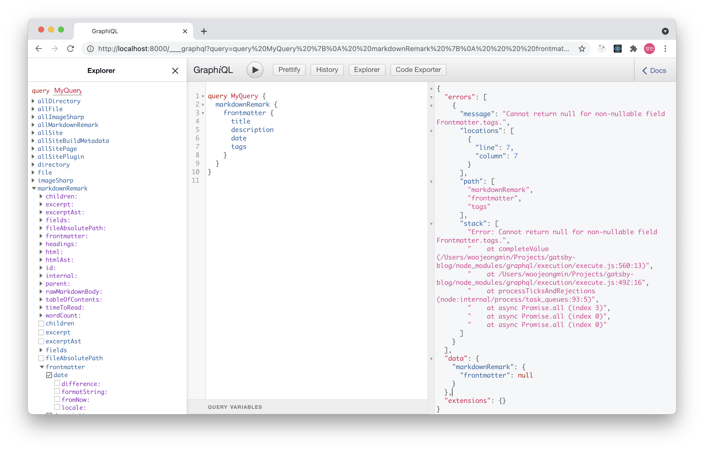
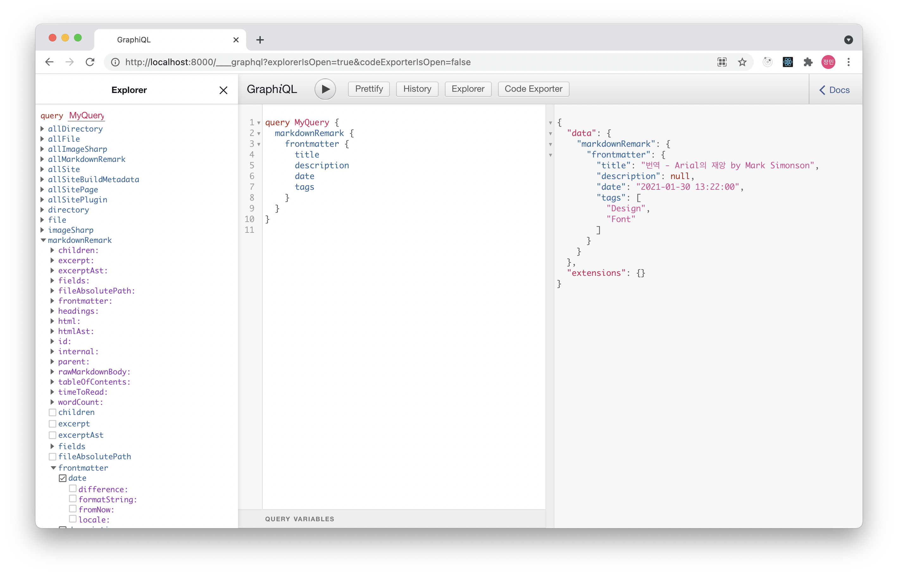

md 파일 작성 시 태그 지정을 안했을 때 발생하는 에러를 해결하는 방법입니다.

---

지난번 글에서 태그 기능을 추가한 후 새로운 글을 포스팅했을 때 때음과 같은 에러가 발생하였습니다.

```
Error: EnsureResources was not able to find resources for path: "http://localhost:8000/2021/how-to-install-homebrew-on-m1-mac/"
This typically means that an issue occurred building components for that path.
Run `gatsby clean` to remove any cached elements.
```

`gatsby develop`으로 development server를 열고 [http://localhost:8000/___graphql](http://localhost:8000/___graphql)로 들어가면 GraphiQL에 접속할 수 있습니다. 다음과 같은 쿼리를 실행시켜 tags가 없는 마크다운파일이 어떤 frontmatter를 반환하는지 알아봅시다.

```
query MyQuery {
  markdownRemark {
    frontmatter {
      title
      description
      date
      tags
    }
  }
}
```



Cannot return null for non-nullable field Frontmatter.tags라는 메시지가 나왔습니다. tags의 타입이 null을 허용하지 않고 있었네요. gatsby-node.js에서 tags의 타입을 확인해보면 다음과 같습니다. 

```javascript
exports.createSchemaCustomization = ({ actions }) => {
  const { createTypes } = action의

  createTypes(`
    ...

    type Frontmatter {
      title: String
      description: String
      date: Date @dateformat
      tags: [String!]!
    }

    ...
  `)
}
```

gatsby-node.js에 다음과 같이 tags 필드의 타입이 [String!]!으로 정의 되어있습니다. GraphQL에서 스키마를 작성할 때 필드의 타입 뒤에 "!"를 붙이면 non-nullable로 정의됩니다. 다음과 같이 "!"를 지우겠습니다. 

```javascript
exports.createSchemaCustomization = ({ actions }) => {
  const { createTypes } = actions

  createTypes(`
    ...

    type Frontmatter {
      title: String
      description: String
      date: Date @dateformat
      // highlight-next-line
      tags: [String!]
    }

    ...
  `)
}
```

이제 실행시켜보면 정상적으로 쿼리가 됨을 확인할 수 있습니다.

