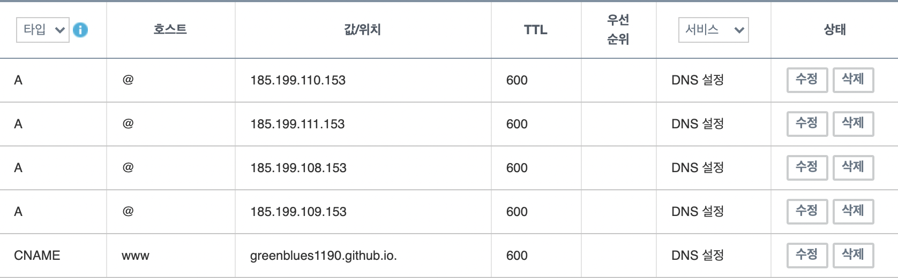

도메인을 구매하여 깃허브 페이지에 연결하는 방법을 소개합니다.

---

## 도메인 등록

[가비아](https://www.gabia.com/)에서 구매했습니다. DNS도 해당 업체의 서비스를 이용했습니다.

---

## A 레코드 설정

해당 도메인의 DNS 레코드 관리 설정에서 `ALIAS`, `ANAME` 혹은 `A` 레코드를 생성합니다. `A` 레코드를 생성하기 위해 [다음 IP 주소](https://docs.github.com/en/pages/configuring-a-custom-domain-for-your-github-pages-site/managing-a-custom-domain-for-your-github-pages-site)를 추가합니다.

```
185.199.108.153
185.199.109.153
185.199.110.153
185.199.111.153
```



---

## gatsby-plugin-cname으로 CNAME 생성하기

Github Pages를 통해 배포를 하다보면 [Github Pages에서 설정한 커스텀 도메인이 초기화되는 문제](https://github.com/tschaub/gh-pages/issues/213)가 발생합니다. Github가 CNAME 파일을 참고하기 때문인데요. CNAME을 생성하는데는 다음과 같은 방법들이 있습니다.

1. `public` 폴더에 `CNAME` 파일 생성
2. npm 스크립트에 `echo "customdomain.com" > build/CNAME` 추가
3. **gatsby-plugin-cname 사용**

그 중 첫번째와 두번째 방법은 커스텀 도메인이 바뀔 때마다 직접 수정을 해야하는 불편함이 있습니다. [gatsby-plugin-cname](https://www.gatsbyjs.com/plugins/gatsby-plugin-cname/)은 `gatsby-config.js`에서 siteUrl을 읽어와 자동으로 CNAME을 생성해주는 플러그인입니다.

### 설치

`npm install gatsby-plugin-cname`

### 적용

`gatsby-config.js` 파일에 다음을 추가합니다.

```javascript:title=gatsby-config.js
module.exports = {
  siteMetadata: {
    siteUrl: 'https://your.custom.domain/'
  },
  plugins: [
    'gatsby-plugin-cname'
  ],
}
```

이제 `npm run deploy`로 배포 시, `gatsby-config.js` 파일의 siteUrl을 읽어 자동으로 CNAME이 생성됩니다.