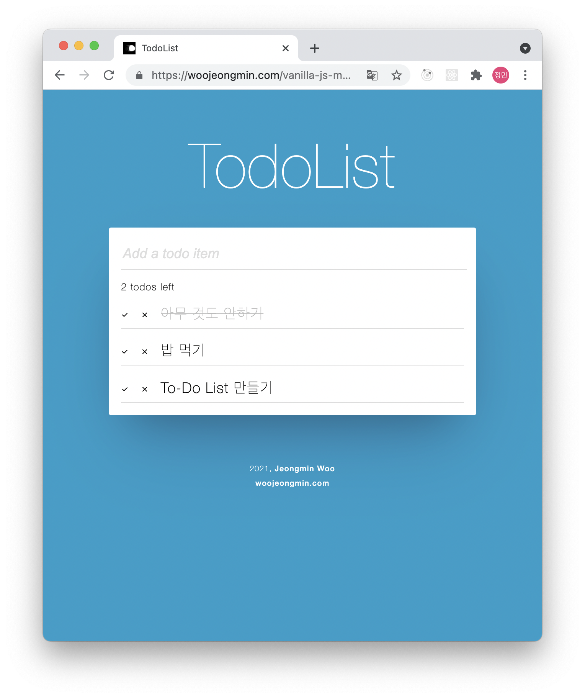

Vanilla JS로 구현한 MVC To-Do List

## MVC.. Vanilla JS.. To-Do List..

그동안 리액트를 쓰면서 바닐라 JS에 대한 이해가 부족하다고 느껴 MVC 패턴 공부 겸 간단한 To-Do List를 만들었다. 구현 모습은 다음과 같다.

https://woojeongmin.com/vanilla-js-mvc-todolist/

항목 추가, 완료, 삭제가 가능한 기초적인 앱이다.  코드는 다음에서 볼 수 있다.

https://github.com/greenblues1190/vanilla-js-mvc-todolist

## 느낀 점들 

구현 후 [todomvc](https://todomvc.com/)의 코드를 보며 리뷰를 했다. todomvc에서는 모델, 뷰, 컨트롤러를 모듈화하여 js파일로 분리시키고 오로지 컨트롤러에서만 모델, 뷰에 접근하는 구조로 구현이 되어있다. 반면 현재 코드에서는 뷰에서 모델의 함수를 참조하는 부분이 있어 수정이 요구된다.

시간이 나면 다음 추가사항들을 구현할 예정.

- **모듈화**
- **모델, 뷰에서 서로 다른 요소에 접근하지 않도록 수정**
- es6+
- 필터링, 완료 항목 삭제 기능
- 리팩토링

https://asfirstalways.tistory.com/248 를 참고하는 것이 좋아보인다.

## 레퍼런스

- https://github.com/tastejs/todomvc/tree/master/examples/vanillajs

- https://github.com/jmuntz/potato-code
